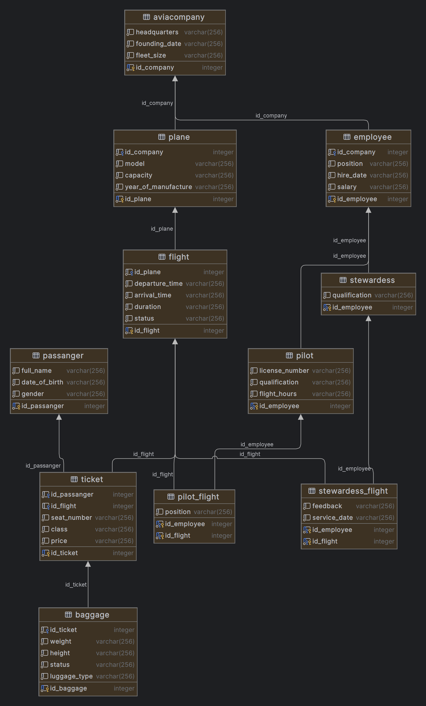

# Airport Database "Narnia" 🛫

> Author: **Rustem Sandibekov** ([*rustemsandibekoov@gmail.com*](mailto\:rustemsandibekoov@gmail.com))

---

## Table of Contents

1. [Project Overview](#project-overview)
2. [Schema](#schema)
3. [Project Structure](#project-structure)
4. [Requirements](#requirements)
5. [Quick Start](#quick-start)
6. [Sample Queries](#sample-queries)
7. [Generating the HTML documentation](#generating-the-html-documentation)
8. [Contributing](#contributing)

---

## Project Overview

“**Narnia**” is a relational database that models day‑to‑day airport operations: passengers, flights, aircraft, crew, baggage handling and the airlines that operate on the airport.\
The schema enforces business rules such as “a plane cannot serve two flights simultaneously” and “a stewardess cannot serve two flights at the same time”.\
It is designed for teaching purposes but can be used as a realistic playground for SQL, query optimisation and data‑oriented application prototyping.

Main entities:

| Entity                                    | Purpose                                                     |
| ----------------------------------------- | ----------------------------------------------------------- |
| **aviacompany**                           | Airlines operating at the airport                           |
| **plane**                                 | Fleet inventory (aircraft type, capacity, manufacture year) |
| **flight**                                | Scheduled or finished flights                               |
| **passenger**                             | Personal data of passengers                                 |
| **ticket**                                | Booking information (class, seat, price, baggage link)      |
| **employee**                              | Airport & airline employees                                 |
| **pilot**/ **stewardess**                 | Specialisations of *employee*                               |
| **baggage**                               | Piece‑wise baggage tracking                                 |
| **pilot\_flight**, **stewardess\_flight** | Assignment tables for crew ↔ flights                        |

## Schema

### Relational schema




The full DDL is stored in [`create.sql`](./create.sql); primary/foreign keys and cascading rules are explicitly defined.\
Synthetic identifiers are implemented with `SERIAL` / sequences.

## Project Structure

```
├── create.sql          # Schema definition (PostgreSQL DDL)
├── insert.sql          # Demo dataset (100+ airlines, 1 000+ employees …)
├── main.xml            # Formal project description (DocBook‑like)
├── sproject.dtd        # DTD for `main.xml`
├── sproject_html.xsl   # XSLT that renders the XML → HTML
├── sproject_html.css   # Styles for the generated HTML docs
├── relational_schema.png
└── README.md           # ← you are here
```

## Requirements

- **PostgreSQL ≥ 11** (uses `plpgsql`, `SERIAL`, `ALTER SEQUENCE … RESTART`).
- `psql` CLI (or any GUI client) to run the scripts.
- *Optional* — `xsltproc` (or any XSLT 1.0 processor) to render the XML documentation.

## Quick Start

```bash
# 1. Clone the repository
git clone https://github.com/<your‑username>/airport‑narnia.git
cd airport‑narnia

# 2. Create an empty database (example assumes super‑user)
createdb airport_narnia

# 3. Load schema & initial data
psql -d airport_narnia -f create.sql
psql -d airport_narnia -f insert.sql

# 4. Explore!
psql -d airport_narnia

-- e.g. list all tables
\dt
```

> **Tip:** The `create.sql` script contains a helper PL/pgSQL function `remove_all()` that drops **all** user tables/sequences.  Handy when you want to reset the schema during development.

## Sample Queries

| ID      | What it does                                                   |
| ------- | -------------------------------------------------------------- |
| **D1**  | All planes manufactured after 2015                             |
| **D3**  | Airlines that operate flights longer than 300 minutes          |
| **D5**  | Passengers who have flown *every* flight                       |
| **D6**  | Passengers who have flown *only* on plane model “Audi”         |
| **D8**  | How many baggage items were handled last month                 |
| **D12** | Employees & pilots with license numbers and flight hours       |
| **D15** | View `PilotsWithHighSalary` — pilots earning > 1 000 CZK/month |

See [`main.xml`](./main.xml) or the rendered HTML for the complete collection (20+ queries, algebra ✕ SQL).

## Generating the HTML documentation

```bash
xsltproc --output docs.html sproject_html.xsl main.xml
# open docs.html in your browser 🖥️
```

The output mimics FIT ČVUT’s template and contains rich formatting, comments toggle and colour‑coded SQL.

## Contributing

Pull requests are welcome — feel free to improve the sample data, add new business rules or optimised query variants.

